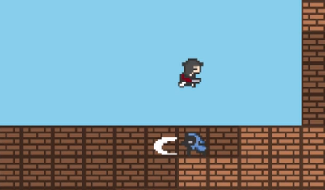
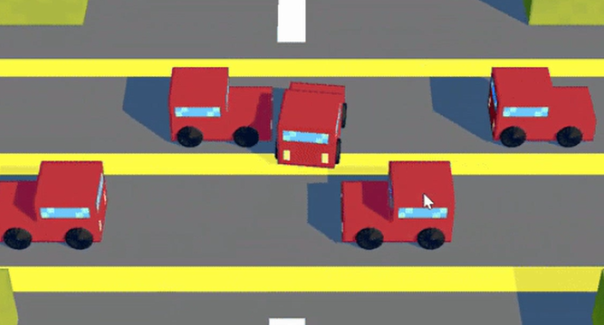

# Hi, I'm Shaurya Sharma!

## Tech Stack

### Languages

[![SQL](https://img.shields.io/badge/SQL-blue.svg?logo=data:image/svg+xml;base64,PHN2ZyB4bWxucz0iaHR0cDovL3d3dy53My5vcmcvMjAwMC9zdmciIHdpZHRoPSIxNiIgaGVpZ2h0PSIxNiIgZmlsbD0iY3VycmVudENvbG9yIiBjbGFzcz0iYmkgYmktZGF0YWJhc2UtZmlsbCIgdmlld0JveD0iMCAwIDE2IDE2Ij4KICA8cGF0aCBkPSJNMy45MDQgMS43NzdDNC45NzggMS4yODkgNi40MjcgMSA4IDFzMy4wMjIuMjg5IDQuMDk2Ljc3N0MxMy4xMjUgMi4yNDUgMTQgMi45OTMgMTQgNHMtLjg3NSAxLjc1NS0xLjkwNCAyLjIyM0MxMS4wMjIgNi43MTEgOS41NzMgNyA4IDdzLTMuMDIyLS4yODktNC4wOTYtLjc3N0MyLjg3NSA1Ljc1NSAyIDUuMDA3IDIgNHMuODc1LTEuNzU1IDEuOTA0LTIuMjIzIi8+CiAgPHBhdGggZD0iTTIgNi4xNjFWN2MwIDEuMDA3Ljg3NSAxLjc1NSAxLjkwNCAyLjIyM0M0Ljk3OCA5LjcxIDYuNDI3IDEwIDggMTBzMy4wMjItLjI4OSA0LjA5Ni0uNzc3QzEzLjEyNSA4Ljc1NSAxNCA4LjAwNyAxNCA3di0uODM5Yy0uNDU3LjQzMi0xLjAwNC43NTEtMS40OS45NzJDMTEuMjc4IDcuNjkzIDkuNjgyIDggOCA4cy0zLjI3OC0uMzA3LTQuNTEtLjg2N2MtLjQ4Ni0uMjItMS4wMzMtLjU0LTEuNDktLjk3MiIvPgogIDxwYXRoIGQ9Ik0yIDkuMTYxVjEwYzAgMS4wMDcuODc1IDEuNzU1IDEuOTA0IDIuMjIzQzQuOTc4IDEyLjcxMSA2LjQyNyAxMyA4IDEzczMuMDIyLS4yODkgNC4wOTYtLjc3N0MxMy4xMjUgMTEuNzU1IDE0IDExLjAwNyAxNCAxMHYtLjgzOWMtLjQ1Ny40MzItMS4wMDQuNzUxLTEuNDkuOTcyLTEuMjMyLjU2LTIuODI4Ljg2Ny00LjUxLjg2N3MtMy4yNzgtLjMwNy00LjUxLS44NjdjLS40ODYtLjIyLTEuMDMzLS41NC0xLjQ5LS45NzIiLz4KICA8cGF0aCBkPSJNMiAxMi4xNjFWMTNjMCAxLjAwNy44NzUgMS43NTUgMS45MDQgMi4yMjNDNC45NzggMTUuNzExIDYuNDI3IDE2IDggMTZzMy4wMjItLjI4OSA0LjA5Ni0uNzc3QzEzLjEyNSAxNC43NTUgMTQgMTQuMDA3IDE0IDEzdi0uODM5Yy0uNDU3LjQzMi0xLjAwNC43NTEtMS40OS45NzItMS4yMzIuNTYtMi44MjguODY3LTQuNTEuODY3cy0zLjI3OC0uMzA3LTQuNTEtLjg2N2MtLjQ4Ni0uMjItMS4wMzMtLjU0LTEuNDktLjk3MiIvPgo8L3N2Zz4=)](#)

### Frameworks

This README uses badges provided by [inttter/md-badges](https://github.com/inttter/md-badges), with the exception of the SQL badge which uses an icon from [Bootstrap Icons](https://icons.getbootstrap.com/icons/database-fill/). All badges use [shields.io](https://shields.io/).

## Links

Click [here](https://shaurya-sharma-dev.github.io/) for my personal website!

## Projects

### pygame-topdownengine
 
pygame-topdownengine is a 2.5D engine for top-down games. It is designed to be highly modular, with most core systems being located in the easily extendible GameObject class. It is built on top of the pygame-ce package, which you can find [here](https://github.com/pygame-community/pygame-ce/tree/main).

You can access the repository for pygame-topdownengine [here](https://github.com/shaurya-sharma-dev/pygame-topdownengine).

### Scout of Liberty
 
Scout of Liberty is a 2D retro-style platformer game made in pygame-ce inspired by the American Revolution. It is set in the 1770s during the American Revolution. The player is a fictional scout for the Sons of Liberty. You can play a web version right now that features mobile support by clicking [here](https://shaurya-sharma-dev.github.io/scout-of-liberty/).

### Pixel Patcher
 
Race against the clock to patch bugs in your upcoming game in this action-packed platformer! The catch? The game's so broken you have to exploit those bugs to navigate through levels.

You can play the game right now by clicking [here](https://shaurya-sharma-dev.github.io/pixel-patcher/).

### Driver Dilemma
 
A driving game made in Ursina that challenges the player to navigate through a series of challenging levels. The game features obstacles, custom camera movement, a pause menu, etc. It relies heavily on custom-textured Blockbench models for the player, the levels, and even some of the obstacles!

You can view the repository by clicking [here](https://github.com/shaurya-sharma-dev/driver-dilemma).