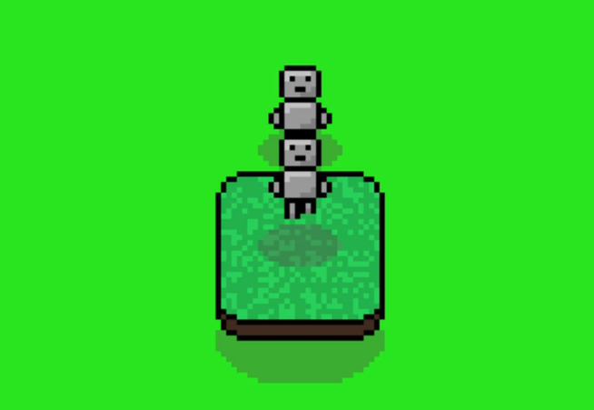

# Hi, I'm Shaurya Sharma!

Note: My top languages does not correlate with skill level for each. It simply refers to the amount of code I have uploaded for each language to GitHub. There are also other languages that I use that are not included because I do not have any repositories on GitHub that use them.

## Tech Stack

### Languages

[![SQL](https://img.shields.io/badge/SQL-blue.svg?logo=)](#)

### Frameworks

## Links

Click [here](https://shaurya-sharma-dev.github.io/) for my personal website, where you can view all of my projects!

## Check out pygame-topdownengine!

 

pygame-topdownengine is a 2.5D engine for top-down games. It is designed to be highly modular, with most core systems being located in the easily extendible GameObject class. It is built on top of the pygame-ce package, which you can find [here](https://github.com/pygame-community/pygame-ce/tree/main).

You can access the repository for pygame-topdownengine [here](https://github.com/shaurya-sharma-dev/pygame-topdownengine).

## Attribution
This README uses badges provided by [inttter/md-badges](https://github.com/inttter/md-badges) (licensed under MIT), with the exception of the SQL badge which uses an icon from [Bootstrap Icons](https://icons.getbootstrap.com/icons/database-fill/) (also licensed under MIT). All badges use [shields.io](https://shields.io/).

This README also uses stats cards generated using [stats-organization/github-readme-stats-action](https://github.com/stats-organization/github-readme-stats-action/), which is also licensed under the MIT license.

  
inttter/md-badges license

MIT License

Copyright (C) 2026 Inter

Permission is hereby granted, free of charge, to any person obtaining a copy
of this software and associated documentation files (the "Software"), to deal
in the Software without restriction, including without limitation the rights
to use, copy, modify, merge, publish, distribute, sublicense, and/or sell
copies of the Software, and to permit persons to whom the Software is
furnished to do so, subject to the following conditions:

The above copyright notice and this permission notice shall be included in all
copies or substantial portions of the Software.

THE SOFTWARE IS PROVIDED "AS IS", WITHOUT WARRANTY OF ANY KIND, EXPRESS OR
IMPLIED, INCLUDING BUT NOT LIMITED TO THE WARRANTIES OF MERCHANTABILITY,
FITNESS FOR A PARTICULAR PURPOSE AND NONINFRINGEMENT. IN NO EVENT SHALL THE
AUTHORS OR COPYRIGHT HOLDERS BE LIABLE FOR ANY CLAIM, DAMAGES OR OTHER
LIABILITY, WHETHER IN AN ACTION OF CONTRACT, TORT OR OTHERWISE, ARISING FROM,
OUT OF OR IN CONNECTION WITH THE SOFTWARE OR THE USE OR OTHER DEALINGS IN THE
SOFTWARE.

  
stats-organization/github-readme-stats-action license

MIT License

Copyright (c) 2025 stats-organization

Permission is hereby granted, free of charge, to any person obtaining a copy
of this software and associated documentation files (the "Software"), to deal
in the Software without restriction, including without limitation the rights
to use, copy, modify, merge, publish, distribute, sublicense, and/or sell
copies of the Software, and to permit persons to whom the Software is
furnished to do so, subject to the following conditions:

The above copyright notice and this permission notice shall be included in all
copies or substantial portions of the Software.

THE SOFTWARE IS PROVIDED "AS IS", WITHOUT WARRANTY OF ANY KIND, EXPRESS OR
IMPLIED, INCLUDING BUT NOT LIMITED TO THE WARRANTIES OF MERCHANTABILITY,
FITNESS FOR A PARTICULAR PURPOSE AND NONINFRINGEMENT. IN NO EVENT SHALL THE
AUTHORS OR COPYRIGHT HOLDERS BE LIABLE FOR ANY CLAIM, DAMAGES OR OTHER
LIABILITY, WHETHER IN AN ACTION OF CONTRACT, TORT OR OTHERWISE, ARISING FROM,
OUT OF OR IN CONNECTION WITH THE SOFTWARE OR THE USE OR OTHER DEALINGS IN THE
SOFTWARE.

  
Bootstrap Icons license

The MIT License (MIT)

Copyright (c) 2019-2024 The Bootstrap Authors

Permission is hereby granted, free of charge, to any person obtaining a copy
of this software and associated documentation files (the "Software"), to deal
in the Software without restriction, including without limitation the rights
to use, copy, modify, merge, publish, distribute, sublicense, and/or sell
copies of the Software, and to permit persons to whom the Software is
furnished to do so, subject to the following conditions:

The above copyright notice and this permission notice shall be included in
all copies or substantial portions of the Software.

THE SOFTWARE IS PROVIDED "AS IS", WITHOUT WARRANTY OF ANY KIND, EXPRESS OR
IMPLIED, INCLUDING BUT NOT LIMITED TO THE WARRANTIES OF MERCHANTABILITY,
FITNESS FOR A PARTICULAR PURPOSE AND NONINFRINGEMENT. IN NO EVENT SHALL THE
AUTHORS OR COPYRIGHT HOLDERS BE LIABLE FOR ANY CLAIM, DAMAGES OR OTHER
LIABILITY, WHETHER IN AN ACTION OF CONTRACT, TORT OR OTHERWISE, ARISING FROM,
OUT OF OR IN CONNECTION WITH THE SOFTWARE OR THE USE OR OTHER DEALINGS IN
THE SOFTWARE.

